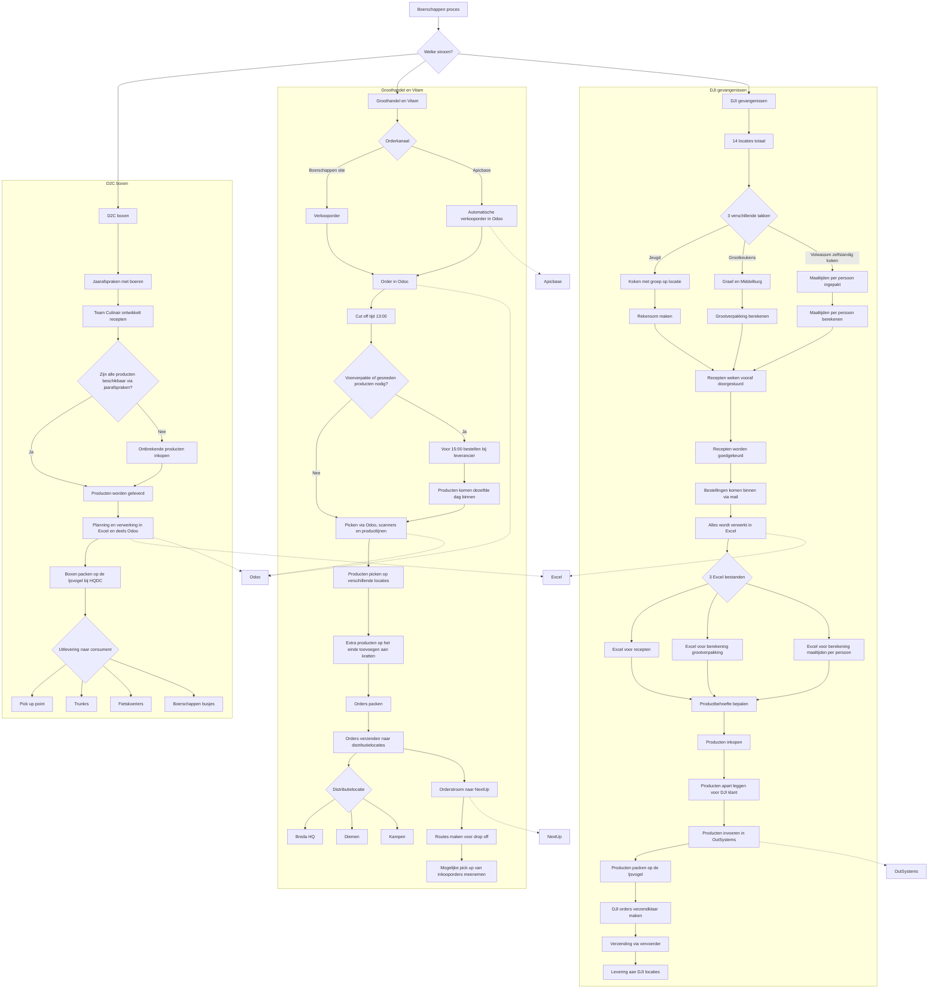

# Boerschappen procesflow

```mermaid
flowchart TD
    A["Boerschappen proces"] --> B{"Welke stroom?"}

    B --> D2C_START["D2C boxen"]
    B --> GH_START["Groothandel en Vitam"]
    B --> DJI_START["DJI gevangenissen"]

    subgraph D2C_FLOW["D2C boxen"]
        D2C_START --> D2C_1["Jaarafspraken met boeren"]
        D2C_1 --> D2C_2["Team Culinair ontwikkelt recepten"]
        D2C_2 --> D2C_3{"Zijn alle producten beschikbaar via jaarafspraken?"}

        D2C_3 -->|Ja| D2C_5["Producten worden geleverd"]
        D2C_3 -->|Nee| D2C_4["Ontbrekende producten inkopen"]
        D2C_4 --> D2C_5

        D2C_5 --> D2C_6["Planning en verwerking in Excel en deels Odoo"]
        D2C_6 --> D2C_7["Boxen packen op de Ijsvogel bij HQDC"]
        D2C_7 --> D2C_8{"Uitlevering naar consument"}

        D2C_8 --> D2C_9["Pick up point"]
        D2C_8 --> D2C_10["Trunkrs"]
        D2C_8 --> D2C_11["Fietskoeriers"]
        D2C_8 --> D2C_12["Boerschappen busjes"]
    end

    subgraph GH_FLOW["Groothandel en Vitam"]
        GH_START --> GH_1{"Orderkanaal"}
        GH_1 -->|Boerschappen site| GH_2["Verkooporder"]
        GH_1 -->|Apicbase| GH_3["Automatische verkooporder in Odoo"]

        GH_2 --> GH_4["Order in Odoo"]
        GH_3 --> GH_4

        GH_4 --> GH_5["Cut off tijd 13:00"]
        GH_5 --> GH_6{"Voorverpakte of gesneden producten nodig?"}

        GH_6 -->|Nee| GH_9["Picken via Odoo, scanners en productlijnen"]
        GH_6 -->|Ja| GH_7["Voor 15:00 bestellen bij leverancier"]
        GH_7 --> GH_8["Producten komen dezelfde dag binnen"]
        GH_8 --> GH_9

        GH_9 --> GH_10["Producten picken op verschillende locaties"]
        GH_10 --> GH_11["Extra producten op het einde toevoegen aan kratten"]
        GH_11 --> GH_12["Orders packen"]
        GH_12 --> GH_13["Orders verzenden naar distributielocaties"]

        GH_13 --> GH_14{"Distributielocatie"}
        GH_14 --> GH_15["Breda HQ"]
        GH_14 --> GH_16["Diemen"]
        GH_14 --> GH_17["Kampen"]

        GH_13 --> GH_18["Orderstroom naar NextUp"]
        GH_18 --> GH_19["Routes maken voor drop off"]
        GH_19 --> GH_20["Mogelijke pick up van inkooporders meenemen"]
    end

    subgraph DJI_FLOW["DJI gevangenissen"]
        DJI_START --> DJI_1["14 locaties totaal"]
        DJI_1 --> DJI_2{"3 verschillende takken"}

        DJI_2 -->|Jeugd| DJI_3["Koken met groep op locatie"]
        DJI_2 -->|Grootkeukens| DJI_4["Graaf en Middelburg"]
        DJI_2 -->|Volwassen zelfstandig koken| DJI_5["Maaltijden per persoon ingepakt"]

        DJI_3 --> DJI_6["Rekensom maken"]
        DJI_4 --> DJI_7["Grootverpakking berekenen"]
        DJI_5 --> DJI_8["Maaltijden per persoon berekenen"]

        DJI_6 --> DJI_9["Recepten weken vooraf doorgestuurd"]
        DJI_7 --> DJI_9
        DJI_8 --> DJI_9

        DJI_9 --> DJI_10["Recepten worden goedgekeurd"]
        DJI_10 --> DJI_11["Bestellingen komen binnen via mail"]
        DJI_11 --> DJI_12["Alles wordt verwerkt in Excel"]

        DJI_12 --> DJI_13{"3 Excel bestanden"}
        DJI_13 --> DJI_14["Excel voor recepten"]
        DJI_13 --> DJI_15["Excel voor berekening grootverpakking"]
        DJI_13 --> DJI_16["Excel voor berekening maaltijden per persoon"]

        DJI_14 --> DJI_17["Productbehoefte bepalen"]
        DJI_15 --> DJI_17
        DJI_16 --> DJI_17

        DJI_17 --> DJI_18["Producten inkopen"]
        DJI_18 --> DJI_19["Producten apart leggen voor DJI klant"]
        DJI_19 --> DJI_20["Producten invoeren in OutSystems"]
        DJI_20 --> DJI_21["Producten packen op de Ijsvogel"]
        DJI_21 --> DJI_22["DJI orders verzendklaar maken"]
        DJI_22 --> DJI_23["Verzending via vervoerder"]
        DJI_23 --> DJI_24["Levering aan DJI locaties"]
    end

    D2C_6 -.-> SYS_1["Excel"]
    D2C_6 -.-> SYS_2["Odoo"]

    GH_3 -.-> SYS_3["Apicbase"]
    GH_4 -.-> SYS_2
    GH_9 -.-> SYS_2
    GH_18 -.-> SYS_4["NextUp"]

    DJI_12 -.-> SYS_1
    DJI_20 -.-> SYS_5["OutSystems"]
```
