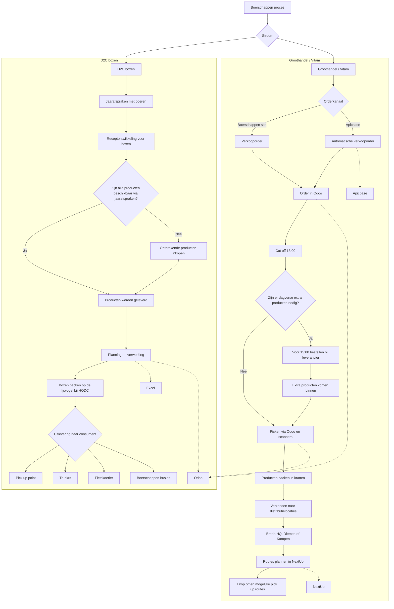

# Boerschappen processen

## Management flowchart

```mermaid
flowchart TD
    A[Boerschappen proces] --> B{Stroom}

    B --> C[D2C boxen]
    B --> D[Groothandel / Vitam]

    subgraph D2C [D2C boxen]
        C --> C1[Jaarafspraken met boeren]
        C1 --> C2[Receptontwikkeling voor boxen]
        C2 --> C3{Zijn alle producten beschikbaar via jaarafspraken?}

        C3 -->|Ja| C5[Producten worden geleverd]
        C3 -->|Nee| C4[Ontbrekende producten inkopen]
        C4 --> C5

        C5 --> C6[Planning en verwerking]
        C6 --> C7[Boxen packen op de Ijsvogel bij HQDC]
        C7 --> C8{Uitlevering naar consument}

        C8 --> C9[Pick up point]
        C8 --> C10[Trunkrs]
        C8 --> C11[Fietskoerier]
        C8 --> C12[Boerschappen busjes]

        C6 -.-> S1[Excel]
        C6 -.-> S2[Odoo]
    end

    subgraph GH [Groothandel / Vitam]
        D --> D1{Orderkanaal}
        D1 -->|Boerschappen site| D2[Verkooporder]
        D1 -->|Apicbase| D3[Automatische verkooporder]

        D2 --> D4[Order in Odoo]
        D3 --> D4

        D4 --> D5[Cut off 13:00]
        D5 --> D6{Zijn er dagverse extra producten nodig?}

        D6 -->|Nee| D9[Picken via Odoo en scanners]
        D6 -->|Ja| D7[Voor 15:00 bestellen bij leverancier]
        D7 --> D8[Extra producten komen binnen]
        D8 --> D9

        D9 --> D10[Producten packen in kratten]
        D10 --> D11[Verzenden naar distributielocaties]
        D11 --> D12[Breda HQ, Diemen of Kampen]
        D12 --> D13[Routes plannen in NextUp]
        D13 --> D14[Drop off en mogelijke pick up routes]

        D3 -.-> S3[Apicbase]
        D4 -.-> S2
        D9 -.-> S2
        D13 -.-> S4[NextUp]
    end
```
